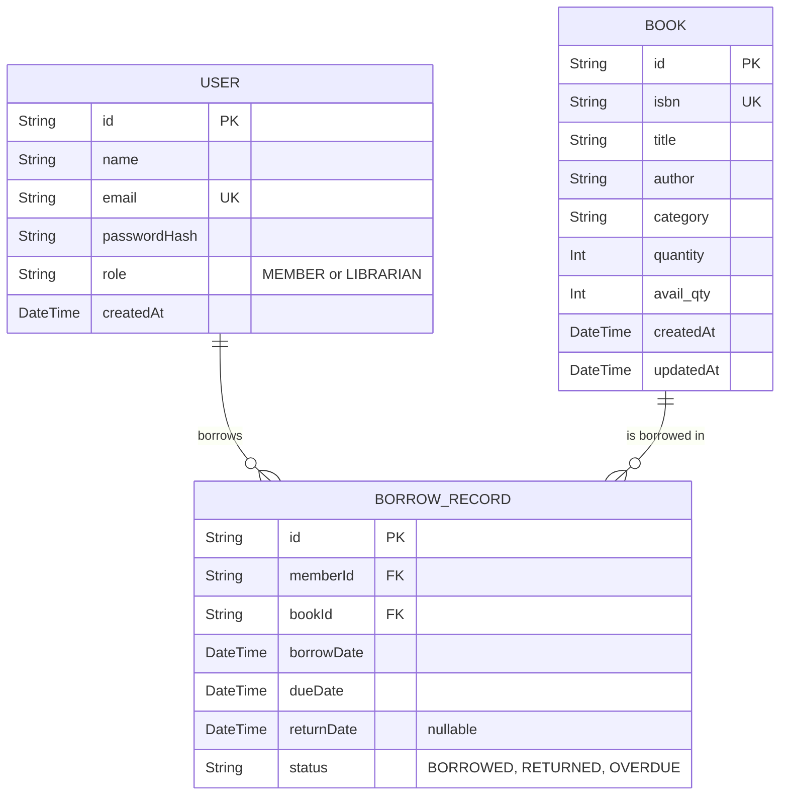

# Library Management System

A production-ready full-stack Library Management System built with Node.js, Express, Prisma, SQLite, and a React + Vite frontend.

## Architecture
The application follows a standard modular monolith architecture:
- **Presentation Layer:** React (Vite) Single Page Application serving dynamic UI
- **API Layer:** Express.js routing requests and providing global error handling, rate limiting, and CORS
- **Business Logic Layer:** Service classes encapsulating core logic (Auth, Book, Borrow, Member)
- **Data Access Layer:** Prisma ORM communicating with the SQLite database
- **Security:** Helmet for HTTP headers, bcryptjs for password hashing, and jsonwebtoken for stateless authentication.

## Folder Structure
```
.
├── prisma/                 # Prisma schema and SQLite database file
├── src/                    # Source code
│   ├── config/             # Database connection and configs
│   ├── controllers/        # Express route controllers
│   ├── middlewares/        # Custom middlewares (auth, roles, errors)
│   ├── routes/             # API route definitions
│   ├── services/           # Business logic layer
│   ├── types/              # TypeScript interfaces and enums
│   ├── utils/              # Helper utilities (JWT, Hashing, Logger)
│   ├── validators/         # Input validation rules (express-validator)
│   ├── App.tsx             # Main React Application
│   └── main.tsx            # React Entry Point
├── package.json            # Dependencies and scripts
└── server.ts               # Express application entry point
```

## ER Diagram


## Environment Variables
Create a `.env` file in the root directory:
```env
DATABASE_URL="file:./dev.db"
JWT_SECRET="your-super-secret-key-change-in-production"
JWT_EXPIRES_IN="15m"
NODE_ENV="development"
PORT=3000
```

## Installation
1. Install dependencies:
   ```bash
   npm install
   ```
2. Initialize database:
   ```bash
   npx prisma generate
   npx prisma migrate dev --name init
   ```
3. Start the development server (Backend + Frontend):
   ```bash
   npm run dev
   ```

## Deployment
This application is ready to be deployed to Render or Railway. Because it's a modular monolith, both the frontend and backend are served together in production.

1. **Database:** You must use a PostgreSQL database or a persistent disk for SQLite in production. If using Render, create a PostgreSQL instance and copy the Internal Database URL.
2. **Environment Variables:** Set the following in your hosting provider's dashboard:
   - `NODE_ENV=production`
   - `DATABASE_URL` (Your production database URL)
   - `JWT_SECRET` (A strong random string)
3. **Build Command:** `npm install && npm run build` (This builds both the frontend Vite app and the backend TS code)
4. **Start Command:** `npm run start`

## API Docs (Postman Collection)
You can test the API by importing this JSON into Postman, or reviewing the endpoint structure below:

### Authentication
- `POST /api/auth/register` - Register a new member
- `POST /api/auth/login` - Login to receive JWT

### Books
- `GET /api/books` - List all books (Supports `?search=` and `?category=`)
- `POST /api/books` - Add a new book (Librarian only)
- `GET /api/books/:id` - Get book details
- `PUT /api/books/:id` - Update book details (Librarian only)
- `DELETE /api/books/:id` - Delete a book (Librarian only)

### Borrows
- `POST /api/borrows/borrow` - Borrow a book
- `POST /api/borrows/return` - Return a borrowed book
- `GET /api/borrows/my-active` - View active borrows (Member)
- `GET /api/borrows/my-history` - View borrow history (Member)

### Members
- `GET /api/members` - List all members (Librarian only)
- `DELETE /api/members/:id` - Delete a member (Librarian only)
